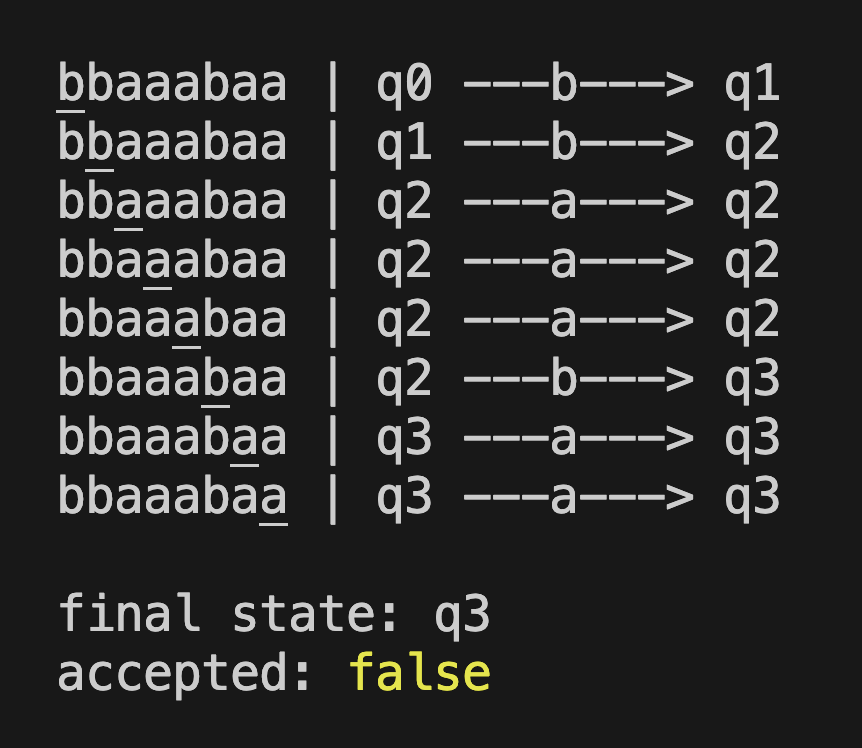

# Aufgabe

Entwickle eine Klasse, die einen endlichen deterministischen Automaten (DEA) modelliert, vgl. [Wikipedia](https://de.wikipedia.org/wiki/Deterministischer_endlicher_Automat). Der Konstruktur soll 5 Objekte entgegennehmen:

- ein Array `states` von Strings, genannt _Zustände_
- ein _Startzustand_ `start_state`
- ein Array `alphabet` von Zeichen, genannt _Alphabet_
- ein Array (oder eine Menge) von Endzuständen `final_states`
- eine Übergangsfunktion `Zustände x Alphabet -> Zustände`, die durch ein geschachteltes Objekt `transitions` der Form `Zustände -> (Alphabet -> Zustände)` modelliert wird (siehe Beispiel unten).

Die TypeScript-Version soll hierbei vollständig typsicher sein, sodass also zum Beispiel kein Zustand in der Übergangsfunktion fehlen darf.

Die Klasse soll außerdem

1. eine Methode `accepts(input)` bereitstellen, welche feststellt, ob ein Eingabetext vom Automaten akzeptiert wird, also nach der Verarbeitung jedes Zeichens in einem Endzustand landet. Wenn ein Zeichen nicht im Alphabet vorkommt, soll ein Fehler geworfen werden.

2. eine Methode `process(input)` bereitstellen, die die Verarbeitung des Eingabetextes Schritt für Schritt grafisch ansprechend in der Konsole darstellt (siehe Beispiel unten).

# Beispiel

```js
/**
 * DEA der Strings akzeptiert die höchstens zwei b enthalten.
 */
const dfa = new DFA({
	states: ["q0", "q1", "q2", "q3"],
	alphabet: ["a", "b"],
	start_state: "q0",
	final_states: ["q0", "q1", "q2"],
	transitions: {
		q0: { a: "q0", b: "q1" },
		q1: { a: "q1", b: "q2" },
		q2: { a: "q2", b: "q3" },
		q3: { a: "q3", b: "q3" },
	},
});

dfa.accepts("aaaaaaaa") === true;
dfa.accepts("aabaabaa") === true;
dfa.accepts("bbaaabaa") === false;
dfa.accepts("bbbaabab") === false;
```

In diesem Beispiel soll

```js
dfa.accepts("abc");
```

einen Fehler werfen, weil _c_ nicht zum Alphabet gehört. Außerdem soll

```js
dfa.process("bbaaabaa");
```

in etwa Folgendes in die Konsole schreiben (die genaue Visualisierung ist dir überlassen):



# Themen

Automaten, Klassen, Strings
