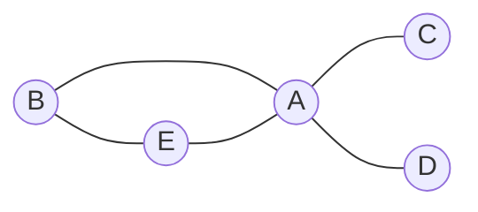
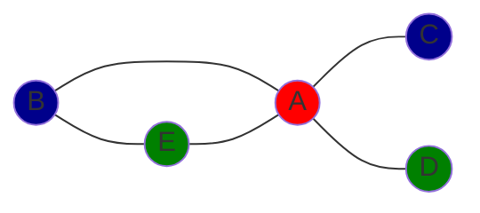
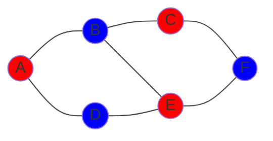

# Graphen und Sudokus

Dies ist eine Reihe von eng miteinander verwandten Aufgaben. Genauer gesagt, sind Aufgaben 2 und 3 eine Anwendung von Aufgabe 1.

## Aufgabe 1

Implementiere eine Funktion, welche zu einem Graphen und einer Liste von Farben auf effiziente Weise eine Liste aller Färbungen der Knoten des Graphen ausgibt, sodass benachbarte Knoten unterschiedliche Farben bekommen. Ein Graph wird hierbei modelliert durch ein Objekt, das jedem Knoten (ein String) eine Liste der benachbarten Knoten zuordnet, die Liste der Farben ist ein Array von Strings, und eine Färbung ist ein Objekt, das jedem Knoten eine Farbe zuordnet.





Arbeite mit einem Backtracking-Algorithmus und wähle den nächsten Knoten jeweils mit der Heuristik aus, dass möglichst wenige Farben für ihn noch in Frage kommen.

Die Funktion sollte außerdem optional eine Teilfärbung des Graphen entgegennehmen, die dann nur noch ergänzt wird.

## Beispiele

**Eingabe**

```js
/*
A --- B
*/
const graph = {
	A: ["B"],
	B: ["A"],
}
const colors = ["red", "blue"]

get_colorings(graph, colors)
```

**Ausgabe**

```json
[
	{
		"A": "red",
		"B": "blue"
	},
	{
		"A": "blue",
		"B": "red"
	}
]
```

**Eingabe**

```js
/*
A -- B -- C
|    |    |
D -- E -- F
*/
const graph = {
	A: ["B", "D"],
	B: ["A", "E", "C"],
	C: ["B", "F"],
	D: ["A", "E"],
	E: ["D", "B", "F"],
	F: ["E", "C"],
}
const colors = ["red", "blue"]

get_colorings(graph, colors, { A: "red" })
```

**Ausgabe**

```json
[
	{
		"A": "red",
		"B": "blue",
		"C": "red",
		"D": "blue",
		"E": "red",
		"F": "blue"
	}
]
```



**Eingabe**

```js
/*
  A
 / \
B - C
*/
const graph = {
	A: ["B", "C"],
	B: ["A", "C"],
	C: ["A", "B"],
}
const colors = ["red", "blue"]

get_colorings(graph, colors)
```

**Ausgabe**

```json
[]
```

## Aufgabe 2

Verallgemeinere zunächst die Funktion zur Ermittlung der Garphenfärbungen so, dass Farben beliebige Objekte sein können. Verwende dazu einen generischen Typ.

Dadurch können zum Beispiel auch Zahlen als "Farben" genommen werden. Damit lassen sich nun tatsächlich auch Sudokus lösen:

Interpretiere dazu ein Sudoku als einen Graphen, dessen Knoten die 81 Felder sind, wobei zwei Felder benachbart sind, wenn sie in derselben Zeile, Spalte, oder in demselben 3x3-Block liegen. Wenn wir die Farben 0,1,...,9 wählen (0 = leeres Feld), ist eine (teilweise) Färbung dieses Graphens gerade ein (teilweise) gelöstes Sudoku.

| 0   | 0   | 0   | 0   | 0   | 0   | 6   | 0   | 0   |
| --- | --- | --- | --- | --- | --- | --- | --- | --- |
| 0   | 0   | 0   | 7   | 0   | 0   | 8   | 0   | 5   |
| 0   | 0   | 1   | 0   | 2   | 8   | 0   | 3   | 0   |
| 0   | 0   | 0   | 0   | 0   | 6   | 0   | 2   | 8   |
| 0   | 0   | 2   | 1   | 5   | 0   | 9   | 0   | 0   |
| 0   | 0   | 0   | 0   | 0   | 4   | 0   | 7   | 0   |
| 0   | 8   | 4   | 0   | 0   | 0   | 0   | 5   | 0   |
| 0   | 0   | 3   | 5   | 4   | 0   | 0   | 0   | 7   |
| 2   | 0   | 7   | 0   | 0   | 0   | 4   | 0   | 9   |

Implementiere damit eine Funktion, die sämtliche Lösungen eines Sudokus bestimmt.

## Beispiel

**Eingabe**

```js
const sample = [
	[0, 0, 0, 0, 0, 0, 6, 0, 0],
	[0, 0, 0, 7, 0, 0, 8, 0, 5],
	[0, 0, 1, 0, 2, 8, 0, 3, 0],
	[0, 0, 0, 0, 0, 6, 0, 2, 8],
	[0, 0, 2, 1, 5, 0, 9, 0, 0],
	[0, 0, 0, 0, 0, 4, 0, 7, 0],
	[0, 8, 4, 0, 0, 0, 0, 5, 0],
	[0, 0, 3, 5, 4, 0, 0, 0, 7],
	[2, 0, 7, 0, 0, 0, 4, 0, 9],
]

get_sudoku_solutions(sample)
```

**Ausgabe**

```json
[
	[
		[3, 7, 8, 4, 1, 5, 6, 9, 2],
		[4, 2, 9, 7, 6, 3, 8, 1, 5],
		[5, 6, 1, 9, 2, 8, 7, 3, 4],
		[7, 4, 5, 3, 9, 6, 1, 2, 8],
		[8, 3, 2, 1, 5, 7, 9, 4, 6],
		[1, 9, 6, 2, 8, 4, 5, 7, 3],
		[9, 8, 4, 6, 7, 2, 3, 5, 1],
		[6, 1, 3, 5, 4, 9, 2, 8, 7],
		[2, 5, 7, 8, 3, 1, 4, 6, 9]
	]
]
```

## Aufgabe 3

Ein _Lateinisches Quadrat_ ist eine nxn-Matrix aus Zahlen 0,1,...,n-1, sodass in jeder Zeile unterschiedliche Zahlen und in jeder Spalte unterschiedliche Zahlen stehen. Es heißt _normalisiert_, wenn die erste Zeile 0,1,...,n-1 ist und die erste Spalte 0,1,..,n-1 ist. (Das kann durch eine Umordnung der Zeilen und Spalten immer erreicht werden.) Hier ein Beispiel:

| 0   | 1   | 2   | 3   |
| --- | --- | --- | --- |
| 1   | 3   | 0   | 2   |
| 2   | 0   | 3   | 1   |
| 3   | 2   | 1   | 0   |

Interpretiere ein Lateinisches Quadrat als eine Graphenfärbung und implementiere damit eine Funktion, die sämtliche normalisierten Lateinische Quadrate einer festen Größe berechnet.

## Beispiel

**Eingabe**

```js
get_normalized_latin_squares(4)
```

**Ausgabe**

```json
[
	[
		[0, 1, 2, 3],
		[1, 3, 0, 2],
		[2, 0, 3, 1],
		[3, 2, 1, 0]
	],
	[
		[0, 1, 2, 3],
		[1, 0, 3, 2],
		[2, 3, 0, 1],
		[3, 2, 1, 0]
	],
	[
		[0, 1, 2, 3],
		[1, 0, 3, 2],
		[2, 3, 1, 0],
		[3, 2, 0, 1]
	],
	[
		[0, 1, 2, 3],
		[1, 2, 3, 0],
		[2, 3, 0, 1],
		[3, 0, 1, 2]
	]
]
```

## Themen

Algorithmen, Backtracking, Laufzeitoptimierung, CSP, MRV, Graphen, Sudokus, Lateinische Quadrate
