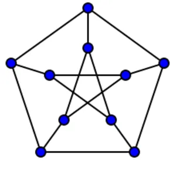

# Chromatisches Polynom

## Kontext

Graphen sind in diesem Kontext einfach, ungerichtet, und endlich.

Eine $k$-_Färbung_ eines Graphen $G$ ordnet jedem Knoten von $G$ eine von $k$ festen Farben zu, sodass benachbarte Knoten unterschiedliche Farben haben (vgl. Aufgabe "Graphen und Sudokus").

Die Funktion $P(G,-)$, die einem $k \geq 0$ die Anzahl der $k$-Färbungen von $G$ zuordnet, stellt sich als ein Polynom mit ganzzahligen Koeffizienten heraus. Das heißt, es gibt ein Polynom $P(G,X) \in \mathbb{Z}[X]$, das _chromatische Polynom_ von $G$, sodass $P(G,k)$ für jedes $k \geq 0$ die Anzahl der $k$-Färbungen von $G$ ist. Mehr Informationen dazu finden sich im [Wikipedia-Artikel](https://en.wikipedia.org/wiki/Chromatic_polynomial).

Das kleinste $k \geq 0$, für das es eine $k$-Färbung gibt, heißt die _chromatische Zahl_ des Graphen.

## Aufgabe

Implementiere eine Funktion, die das chromatische Polynom eines Graphen berechnet.

Entwickle dafür zunächst eine Klasse für Polynome, die Rechenoperationen bereitstellt. Außerdem sollten Polynome eine leserliche String-Repräsentation haben (siehe Beispiele unten).

Benutze dann die Rekursionsgleichung

$$P(G,X) = P(G-vw,X) - P(G / vw,X)$$

aus dem Wikipedia-Artikel.

Implementiere anschließend eine Funktion, die die chromatische Zahl eines Graphen berechnet. Benutze dafür das chromatische Polynom.

## Beispiele

**Kreisgraphen**

```js
/*
       A
     /   \
    B --- C
*/
const g = {
	A: ["B", "C"],
	B: ["A", "C"],
	C: ["A", "B"],
}

const p = get_chromatic_polynomial(g)

// [0, 2, -3, 1]
console.info(p.coefficients)

// X^3 - 3X^2 + 2X
console.info(p.to_string())

console.info(get_chromatic_number(g)) // 3
```

**Bäume**

```js
/*
           A
           |
           B
          / \
         C   D
            / \
           E   F
*/
const g = {
	A: ["B"],
	B: ["A", "C", "D"],
	C: ["B"],
	D: ["B", "E", "F"],
	E: ["D"],
	F: ["D"],
}

const p = get_chromatic_polynomial(g)

// [0, -1, 5, -10, 10, -5, 1]
console.info(p.coefficients)

// X^6 - 5X^5 + 10X^4 - 10X^3 + 5X^2 - X
console.info(p.to_string())

console.info(get_chromatic_number(g)) // 2
```

**Petersen-Graph**



```js
const g = {
	a: ["A", "c", "d"],
	b: ["B", "d", "e"],
	c: ["C", "e", "a"],
	d: ["D", "a", "b"],
	e: ["E", "b", "c"],
	A: ["a", "E", "B"],
	B: ["b", "A", "C"],
	C: ["c", "B", "D"],
	D: ["d", "C", "E"],
	E: ["e", "D", "A"],
}

const p = get_chromatic_polynomial(g)

// X^10 - 15X^9 + 105X^8 - 455X^7 + 1353X^6 - 2861X^5 + 4275X^4 - 4305X^3 + 2606X^2 - 704X
console.info(p.to_string())

console.info(get_chromatic_number(g)) // 3
```

## Themen

Graphen, Rekursion, Polynome, Kombinatorik, Klassen
